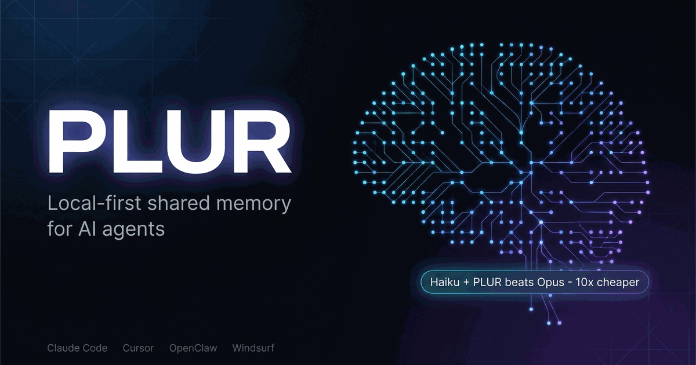

<p align="center">
  <a href="https://plur.ai"></a>
</p>

# PLUR — Your agents share the same memory

[](https://www.npmjs.com/package/@plur-ai/core)
[](https://github.com/plur-ai/plur/actions/workflows/ci.yml)
[](LICENSE)
[](https://github.com/plur-ai/plur/stargazers)

Persistent, **open** memory for AI agents — local-first, zero-cost, shared across MCP tools (Claude Code, Hermes, OpenClaw, Cursor). Your agent's memory is plain-text **engrams** you can read, correct, and delete — not weights you can't.

[plur.ai](https://plur.ai) · [Benchmark](https://plur.ai/benchmark.html) · [Engram Spec](https://plur.ai/spec.html) · [npm](https://www.npmjs.com/org/plur-ai) · [Comparisons](comparisons/)

## Benchmarks

PLUR is memory, not just retrieval — so we measure it on more than one axis, on the **full** corpus, and we publish the harness so you can reproduce every number.

**Retrieval recall — full LongMemEval-S (N=500), R@5, fully local:**

| Stack | R@5 | Notes |
|-------|-----|-------|
| BM25 only | 92.2% | no embedder — fully airgapped |
| Hybrid (BGE-small, shipping default) | 95.6% | bundled local embedder, zero downloads |
| **+ BGE-reranker-v2-m3** | **98.0%** | local cross-encoder, max quality — R@1 93.8%, R@10 99.0% |

Chunk granularity, canonical-doc scoring, corpus SHA256 pinned — reproduce it in [plur-ai/plur-bench](https://github.com/plur-ai/plur-bench). No cloud call is required for any of these numbers (an *optional* cloud embedder, openai-3-large, reaches 97.0% hybrid). A faster reranker — `ms-marco-minilm-l6` (p50≈245ms vs BGE's ≈5s on CPU) — trades a little recall for sub-second latency.

**Run it yourself — and tell us what you get.** The harness is [plur-ai/plur-bench](https://github.com/plur-ai/plur-bench): CPU-runnable, no API key needed for the local path, corpus auto-fetched and SHA-verified. If you run it, we'd genuinely love to see your numbers — open an issue or discussion with your results, **especially if they don't match ours.** Independent reproduction is worth more than any number we publish, and we'll gladly credit you.

**Retrieval ≠ answer accuracy — and we report them separately, never conflated.** End-to-end (LLM-judge) answer accuracy with the reranker stack is **60.5%**, versus **52.0%** for dumping full context into the prompt and **5.5%** with no memory at all.

**Agent-task impact** — same task, with memory vs without: Haiku + PLUR outperforms Opus *without* it at roughly **10× less cost**; house rules **12–0** across Haiku, Sonnet, and Opus.

**Operational** — local-first, zero-cost search, data-sovereign by design.

*More in progress: LoCoMo, agentic task suites, cross-tool portability, decay / contradiction correctness.* [Full methodology →](https://plur.ai/benchmark.html)

## The idea

You correct your agent's coding style on Monday. On Tuesday, it makes the same mistake. You explain your architecture in Cursor. That night, Claude Code has no idea.

PLUR fixes this. Install it once, and corrections, preferences, and conventions persist — across sessions, tools, and machines. Your memory is stored as plain YAML on your disk. No cloud, no API calls, no black box.

The interesting part: in our tool-routing and local-knowledge benchmark, **Haiku with PLUR memory outperformed Opus without it** — 2.6x better on tool routing, at roughly 10x less cost. Turns out the bottleneck isn't model intelligence. It's context.

## Install

### Tell your agent

Paste this to your coding agent (Claude Code, Cursor, Windsurf, OpenClaw):

```text
Set up PLUR memory for me: run `npx @plur-ai/mcp init`, then check my PLUR status to confirm it works.
```

Prefer a guided setup? [plur.ai](https://plur.ai) has the exact config for your tool — Claude Code, Cursor, Windsurf, or OpenClaw.

### Manual setup (Claude Code)

One command sets up everything — storage, MCP config, and Claude Code hooks:

```bash
npx @plur-ai/mcp init
```

This creates `~/.plur/` for storage, adds PLUR to your `.mcp.json`, and installs Claude Code hooks for automatic engram injection. The hooks also **auto-close the memory lifecycle**: a `SessionEnd` hook captures a closing episode and cleans up session state when a conversation ends, so memory closes cleanly even if the agent forgets to call `plur_session_end`. PLUR is installed **globally** — one MCP server, one store, available in every project. You only run init once.

For **multi-project setups**, use domain/scope to separate knowledge:

```bash
cd ~/projects/my-app
npx @plur-ai/cli init --domain myapp --scope project:my-app
```

This creates a `.plur.yaml` in the project with defaults that hooks apply automatically. Engrams learned in that project are tagged; recall filters by scope but always includes global knowledge.

**Set scope per engram, by content.** Scope is not a once-per-session setting — every `plur_learn` call takes its own `scope`, chosen from what the engram is about. Team/shared knowledge goes to a team scope (e.g. `group:<org>/<team>`, used by PLUR Enterprise); project details to `project:<name>`; personal preferences stay local. Don't let team-relevant knowledge fall back to `global` by omitting scope — `global` leaks into every project and (with a team store configured) never reaches the team. `plur_session_start` lists the remote scopes a token can write to.

### Global install (faster startup)

```bash
npm install -g @plur-ai/mcp
plur-mcp init
```

### Cursor

Run init from your project root — it sets up Cursor's `.cursor/mcp.json` (plus Cursor hooks and a context rule):

```bash
npx @plur-ai/mcp init
```

PLUR runs under a **lean tool profile** in Cursor (`PLUR_TOOL_PROFILE=cursor`) — Cursor caps the tools a workspace can expose, so PLUR surfaces a curated core set (learn / recall / inject / status) instead of all 40, with the rest reachable through `plur_admin`. Cursor support shipped in v0.13.

### OpenClaw

```bash
openclaw plugins install @plur-ai/claw
openclaw config set plur.enabled true
```

That's it. PLUR works in the background from here. No workflow changes needed — just use your tools as usual. Corrections accumulate automatically.

### Hermes Agent

```bash
pip install plur-hermes
npm install -g @plur-ai/cli
```

The plugin registers automatically via Hermes' plugin system. It injects relevant memories before each LLM call, extracts learnings from agent responses, and exposes all PLUR tools to the agent. Hermes shells out to the PLUR CLI.

### Python SDK (LangChain, llama.cpp, scripts)

For Python environments that aren't Hermes:

```bash
pip install plur-ai
npm install -g @plur-ai/cli   # bridge (required)
```

```python
from plur_ai import Plur

plur = Plur()
plur.learn("always use async generators for streaming LLM output")
results = plur.recall("streaming patterns")
context = plur.inject("write a streaming endpoint", limit=10)
```

`plur-ai` bridges to the same on-disk store as Claude Code and OpenClaw — memory written from Python is immediately visible across all your tools. See [`packages/python/examples/`](packages/python/examples/) for LangChain and llama.cpp integration examples.

### Verify it works

Ask your agent: *"What's my PLUR status?"* — it should call `plur_status` and return your engram count and storage path.

### See it in action

Once it's running, teach your agent something once:

> *"Always use `pnpm` in this project — `npm install` breaks the lockfile in CI."*

Start a new session the next day and ask:

```
You: How do I run the tests?

<plur-memory> 1 engram · project:my-api </plur-memory>

Agent: Use pnpm — you mentioned npm breaks the lockfile in CI:

  pnpm test                           # full suite
  pnpm test -- src/auth.test.ts       # single file
```

New session. No reminder. The correction was there.

That's the moment PLUR pays off — the agent remembers a project convention you mentioned once, without it being in any file it can read.

## How it works

PLUR has two storage primitives:

**[Engrams](https://plur.ai/spec.html)** — learned knowledge that persists across sessions. Each engram is a typed assertion ("always use blue-green deploys", "never force-push to main") with:

- **Activation** — retrieval strength that decays over time (ACT-R model) and strengthens on access. Stale facts naturally fade from injection without manual cleanup.
- **Feedback signals** — positive/negative ratings that train injection quality over time
- **Scope** — hierarchical namespace (`global`, `project:myapp`, `cluster:prod`, `service:api`) controlling where the engram applies
- **Polarity** — automatic classification of "do" vs "don't" rules, so constraints are injected separately from directives
- **Associations** — links to other engrams, including co-access edges that form automatically when engrams are recalled together

**Episodes** — timestamped event records for "what happened when." Each episode captures a summary, timestamp, agent attribution, and channel. Use episodes for incident timelines, session logs, and operational history. Query by time range, agent, or channel.

```
You correct your agent  →  engram created  →  YAML on your disk
Agent fixes an incident →  episode captured →  timeline searchable
Next session starts     →  relevant engrams injected  →  agent remembers
You rate the result     →  engram strengthens or decays  →  quality improves
Unused engrams          →  activation decays  →  naturally fade from injection
```

Search is fully local: BM25 (with IDF weighting, TF saturation, length normalization) + BGE embeddings + Reciprocal Rank Fusion. Zero API calls, zero per-query cost. [Benchmark methodology →](https://plur.ai/benchmark.html)

Plugins (OpenClaw, Hermes) automatically capture learnings from agent conversations — no manual saving needed. The agent's corrections become engrams without you doing anything.

See the [full engram spec](https://plur.ai/spec.html) for schema details, activation model, and injection algorithm.

## Open format

The engram is an **open, versioned format** — not a black box. Every engram is plain YAML validated against a published [JSON Schema](https://plur.ai/spec.html), generated from the same Zod source the engine uses (the schemas live in [`spec/`](spec/)). Read it, diff it in git, write your own tooling against it, or build a different engine on the same format — your memory isn't locked to PLUR.

## Usage

```typescript
import { Plur } from '@plur-ai/core'

const plur = new Plur()

// Learn from a correction
plur.learn('toEqual() in Vitest is strict — use toMatchObject() for partial matching', {
  type: 'behavioral',
  scope: 'project:my-app',
  domain: 'dev/testing'
})

// Recall (hybrid: BM25 + embeddings, zero cost)
const results = await plur.recallHybrid('vitest assertion matching')

// Inject relevant engrams into agent context
const { engrams } = plur.inject('Write tests for the user service', {
  scope: 'project:my-app',
  limit: 15
})

// Feedback trains the system
plur.feedback(engram.id, 'positive')

// Capture an event (episode)
plur.capture('Fixed CrashLoopBackOff on bee-3-4 by increasing memory limits', {
  agent: 'claude-code',
  channel: 'terminal'
})

// Query timeline
const incidents = plur.timeline({ agent: 'claude-code' })

// Sync across machines (use a private git remote — all engrams including private-visibility ones are pushed)
plur.sync('git@github.com:you/plur-memory.git')
```

### MCP tools

| Tool | What it does |
|------|-------------|
| `plur_learn` | Store a correction, preference, or convention |
| `plur_learn_batch` | Store many engrams in one call (batch dedup + per-item failure isolation) |
| `plur_recall_hybrid` | Retrieve relevant memories (BM25 + embeddings) |
| `plur_inject_hybrid` | Select engrams for current task within token budget |
| `plur_feedback` | Rate relevance (trains quality over time) |
| `plur_forget` | Retire a memory (activation decays, eventually pruned) |
| `plur_capture` | Record an event — incident, resolution, session milestone |
| `plur_timeline` | Query episode history by time, agent, or channel |
| `plur_ingest` | Extract engrams from text automatically |
| `plur_sync` | Sync across devices via git (remote receives all engrams — use a private repo) |
| `plur_status` | Check system health and engram counts |
| `plur_receipt` | Counted, local report of what your memory retrieved for you |

### The memory receipt

`plur receipt` (and the `plur_receipt` MCP tool) show what your memory actually did — counted from PLUR's own retrieval history, never estimated:

```
Your Memory Receipt
===================
  2026-07-03 .. 2026-07-22  (71 sessions)

  423 times a memory you taught PLUR
  was put in front of the model.
  (plus 45 times an installed-pack memory)

  across 71 retrievals in 71 sessions
  drawing on 162 distinct engrams

  MOST-RELIED-ON
      34x  PLUR positioning thesis across every vertical: PLUR layers …
      28x  Datacore app CoS architecture: reasoning layer added on to…
      ...

  STORE HEALTH
       4,517   engrams stored (you: 3,746, packs: 771)
         162   retrieved at least once (4% of store)
       4,355   not retrieved since 2026-07-03 (96%)
    Over a short logging window a low rate is expected, not a fault —
    memory is meant to be selective, and much of the store predates logging.
```

(REUSE stats and coverage caveats are also shown; trimmed here for length.)

It is local and read-only, and carries **no dollar or token figure by design**: on a subscription your marginal token cost is zero, and the value of an avoided rediscovery is not measurable from this data. The receipt reports only what it can count. Activation rate is store *coverage over the logging window*, not a quality score — it is naturally low and falls as you add engrams. `--days N` narrows the window; `--json` emits the raw shape. (The `plur_receipt` MCP tool returns the same figures plus a one-line `summary` that carries this framing to the agent.)

### Syncing across devices

`plur.sync(remote)` is git underneath: it commits your engram store and pushes it to the remote you give it. **The remote receives everything that is pushed — including `visibility: private` engrams.** Private visibility means "don't share this in a pack", not "don't mirror it to my own devices", so private engrams are intentionally synced so your memory follows you from machine to machine.

Because the push contains private engrams, **always use a private git remote** (a private GitHub/GitLab repo, or your own server). PLUR surfaces a `warning` in the sync result reminding you of this whenever private engrams are present. Never point sync at a public repository.

The one exception is **`scope: local` engrams**: these are machine-specific by design (paths, local ports, per-host quirks), so they are stripped from every commit and never reach the remote. They stay in your local working copy only — other devices won't see them, and they won't pollute a shared store.

## Benchmark details

Per-category retrieval recall — full LongMemEval-S (N=500), fully local (BGE-small + BGE-reranker-v2-m3, chunk granularity):

| Category | R@5 | R@10 |
|----------|-----|------|
| single-session-assistant | 100.0% | 100.0% |
| knowledge-update | 100.0% | 100.0% |
| single-session-user | 98.6% | 100.0% |
| multi-session | 98.5% | 100.0% |
| temporal-reasoning | 97.7% | 98.5% |
| single-session-preference | 86.7% | 90.0% |
| **overall** | **98.0%** | **99.0%** |

Retrieval recall (finding the right memory) and end-to-end answer accuracy (whether the model then answers correctly) are **different axes** — PLUR measures and reports them separately, never conflated. The agent-impact figures above come from a same-task A/B run (memory vs none).

[Full methodology →](https://plur.ai/benchmark.html)

## PLUR vs other agent-memory tools

Mem0, Letta (MemGPT), and Zep solve real problems — a drop-in memory API (Mem0), a self-managing agent OS (Letta), a temporal knowledge graph (Zep). PLUR's bet is a combination none of them ship together:

- **Plain-text you own** — engrams are human-readable YAML you can read, `git diff`, edit, and provably delete. Not opaque vectors, agent-state blocks, or graph nodes you need tooling to inspect.
- **Local-first, zero-cost** — hybrid BM25 + local embeddings, fully offline, no API bill (98% R@5 on the full LongMemEval-S corpus with no cloud call — see above).
- **Team-shareable via git** — `plur sync` is git underneath, so the same memory follows you across machines *and* across a team. Most tools are single-user-local *or* cloud-team; PLUR is both, and you keep the data.
- **Cross-tool** — the same `~/.plur/` store works in Claude Code, Cursor, Windsurf, OpenClaw, and Hermes. Your memory isn't trapped in one vendor.
- **It learns and forgets** — feedback-trained retrieval with ACT-R decay and an on-demand contradiction scan, not a grow-forever store.

If you need a hosted memory API or a temporal knowledge graph, use the tool built for that. If you want memory you can **read, own, share with your team, and move between tools**, that's PLUR. Side-by-side detail: [comparisons/](comparisons/).

## What PLUR is — and isn't

PLUR is **agent memory** — it stores corrections, preferences, conventions, and architectural decisions that an AI agent learns during work sessions, and injects them back when they're relevant.

PLUR is **not** a general-purpose search engine, a codebase indexer, or a replacement for code intelligence tools. It doesn't parse ASTs, navigate class hierarchies, or search your source files. If you need code-aware search (tree-sitter, language server features, symbol lookup), tools like [claude-mem](https://github.com/skydeckai/claude-mem) or your IDE's built-in search are the right choice.

The two are complementary:

| | PLUR | Code intelligence tools |
|---|------|------------------------|
| **Stores** | Learned knowledge (engrams) + event timeline (episodes) | Code structure, symbols, definitions |
| **Search** | Engram recall (BM25 + embeddings over memory) | AST traversal, symbol lookup, semantic code search |
| **Learns** | From agent corrections, feedback, usage patterns | From static analysis of source code |
| **Captures** | Auto-extracts learnings from conversations (via plugins) | N/A |
| **Decays** | Yes — unused memories fade (ACT-R model) | No — code index reflects current state |
| **Timeline** | Episodes track what happened when (incidents, fixes, decisions) | Git log only |
| **Cross-tool** | Any MCP client (Claude Code, Cursor, Windsurf, OpenClaw, Hermes) | Typically tied to one tool |

While search is a core part of PLUR (finding the right engram to inject), the search targets are always engrams — not files, not code, not documents. PLUR's hybrid search (BM25 + embeddings + RRF) is optimized for short natural-language assertions, not source code.

## Packages

| Package | Description |
|---------|-------------|
| [`@plur-ai/core`](packages/core) | Engram engine — learn, recall, inject, search, decay |
| [`@plur-ai/mcp`](packages/mcp) | MCP server for Claude Code, Cursor, Windsurf |
| [`@plur-ai/claw`](packages/claw) | OpenClaw ContextEngine plugin |
| [`@plur-ai/cli`](packages/cli) | CLI — plur learn / recall / inject / status |
| [`plur-hermes`](packages/hermes) | Hermes Agent plugin (Python, via CLI bridge) |
| [`plur-ai`](packages/python) | Python SDK — learn/recall/inject for LangChain, llama.cpp, scripts |

## Architecture

```
@plur-ai/core
├── engrams.ts           Engram CRUD + YAML persistence
├── episodes.ts          Episode capture + timeline queries
├── fts.ts               BM25 with IDF, TF saturation (k1/b), length normalization
├── embeddings.ts        BGE-small-en-v1.5, 384-dim, local ONNX
├── hybrid-search.ts     Reciprocal Rank Fusion
├── inject.ts            Context-aware selection + spreading activation
├── decay.ts             ACT-R activation decay
├── secrets.ts           Secret detection (API keys, passwords, tokens)
├── sync.ts              Git-based sync + file locking (O_EXCL)
├── storage.ts           Path detection + YAML I/O
└── storage-indexed.ts   Optional SQLite read index

@plur-ai/mcp          Wraps core as MCP tools
@plur-ai/claw          OpenClaw ContextEngine hooks (assemble/compact/afterTurn)
plur-hermes            Python plugin for Hermes Agent (auto inject/learn)
plur-ai                Python SDK — direct learn/recall/inject for scripts and frameworks
```

### Storage

Everything is plain YAML. Open it, read it, edit it.

```
~/.plur/
├── engrams.yaml     # learned knowledge (source of truth)
├── episodes.yaml    # session timeline
├── config.yaml      # settings
└── engrams.db       # optional SQLite read index (auto-generated)
```

`PLUR_PATH` overrides the default location.

For large stores (>1k engrams), enable the SQLite read index for faster filtered queries. Add `index: true` to `config.yaml`. The YAML file stays the source of truth — the `.db` is a cache that rebuilds automatically. Delete it anytime.

## Requirements

- **Node.js 18+**
- **2GB RAM minimum** — the embedding model (ONNX runtime) needs ~1GB for installation. On servers with less RAM, embeddings are skipped and search falls back to BM25 keyword matching.

## Development

```bash
git clone https://github.com/plur-ai/plur.git
cd plur
pnpm install && pnpm build && pnpm test
```

~3500 tests across ~200 files. `pnpm test:watch` for development.

## Contributing

- **Bug reports** — issue with reproduction steps
- **Feature requests** — issue describing the use case
- **Code** — fork, branch, PR. Tests required.
- **Integrations** — build PLUR support for other tools

Before submitting: `pnpm test` passes, `pnpm build` succeeds, no new external deps in core without discussion.

Conventions: TypeScript, Zod validation, Vitest, no external APIs in core, YAML storage, zero-cost search by default.

## License

Apache-2.0
